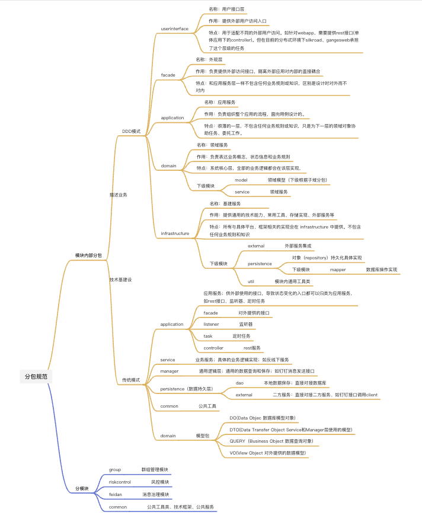

## 个人项目
# hihcxcn

基于`spring-boot`

内部采用DDD分层结构，相应`springboot`示例代码（`dubbo`, `TDDL`, `nacos`等）

## 结构

```
hihcxcn
├── hihcxcn-api
│   ├── README.md 接口说明文档
│   └── src/main/java
│       ├── share 读写接口公共的部分
│       ├── read 读接口
│       └── write 写接口
├── hihcxcn-server
│   ├── README.md 服务说明文档
│   ├── APP-META
│   └── src/main/java
│       ├── application 应用服务层
│       ├── configuration 配置信息
│       ├── domain 领域层
│       └── infrastructure 基础设施层
├── hihcxcn-start
│   ├── README.md 服务说明文档
│   ├── hihcxcn-server.release 部署文件
│   └── src/main/java
│       └── Application.java 服务启动类
└── build.gradle
```  
